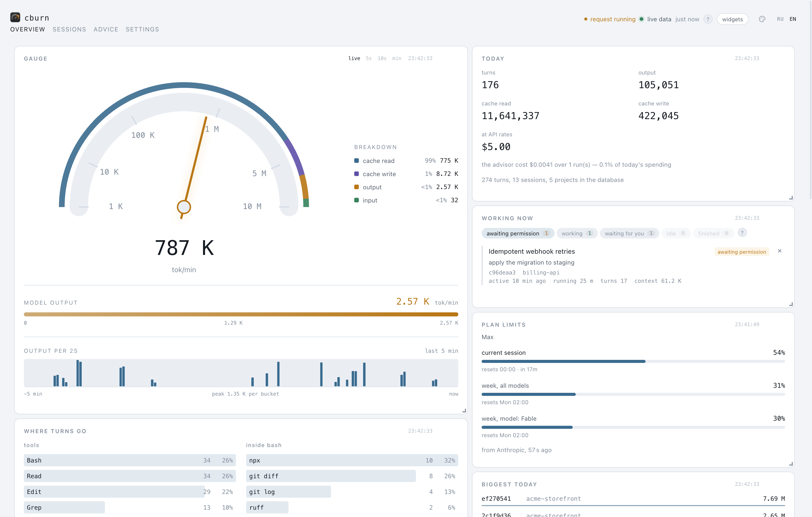
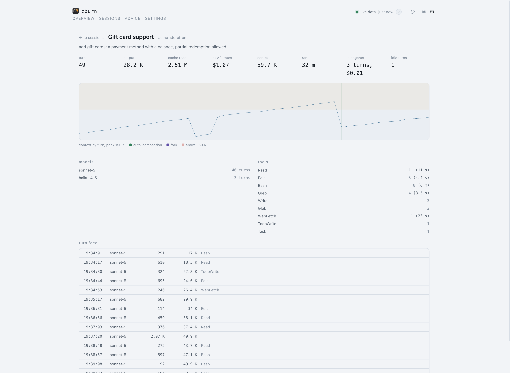
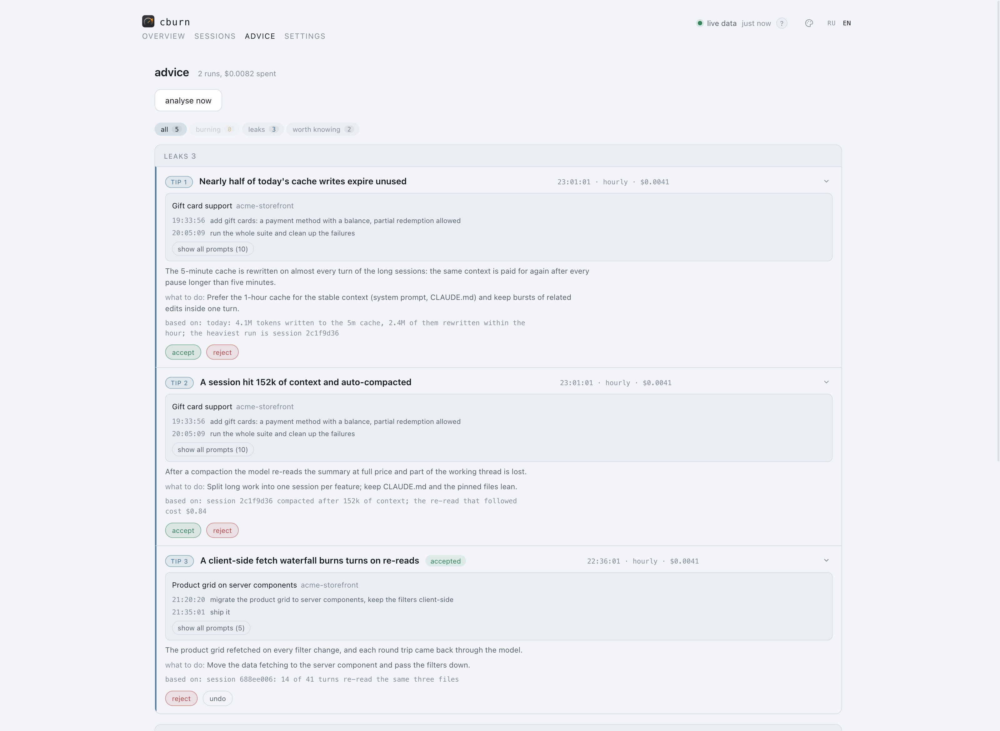

<p align="center">
  
</p>

<h1 align="center">cburn</h1>

<p align="center">
  A local speedometer for Claude Code token spend.
</p>

<p align="center">
  <picture>
    <source media="(prefers-color-scheme: dark)" srcset="docs/dashboard-dark.png" />
    
  </picture>
</p>

cburn watches every Claude Code session on the machine and turns the transcripts
into a live picture of where the tokens go. The needle climbs while Claude works
and glides down in silence; around it - the day's totals, the cost at API prices,
the subscription limit windows and the sessions in flight.

Everything happens locally: the transcripts are read straight from
`~/.claude/projects`, and the conversation text never leaves the machine.

## What it does

- **Live gauge** - the burn rate over WebSocket, moving within a second of a turn landing in a transcript.
- **Cost and totals** - tokens by kind, dollars at API prices, models and tools of the day.
- **Subscription limits** - the 5-hour and weekly windows, refreshed from Anthropic.
- **Advisor** - once an hour `claude -p` reads an anonymised digest and suggests optimisations, with optional telegram notifications.
- **Menu-bar tray** - a Tauri wrapper puts the figures you pick into the macOS menu bar.
- **OTLP receiver** - takes Claude Code telemetry for what the transcripts do not carry.

<p align="center">
  
  
</p>
<p align="center">
  <sub>All screenshots show a synthetic demo dataset - <code>make demo</code> generates it
  and serves a second dashboard without touching the real database.</sub>
</p>

## Quick start

Python 3.11+ and Node are required.

```bash
make install   # .venv, an editable install and the npm dependencies
make web       # build the frontend into web/dist
make reindex   # read the transcripts into the database
make serve     # the dashboard on http://127.0.0.1:8799
```

The interface speaks English and Russian and ships eighteen colour themes
borrowed from VS Code. `cburn install` adds autostart at login (launchd).

## Telemetry (optional)

Claude Code can export OTLP metrics and events, and cburn ships a receiver for
them. Telemetry fills the gaps the history files cannot: service spend that
never reaches a transcript (session titles cost a separate haiku call), how
often work stopped for a permission prompt, exact request prices and durations,
time spent inside tools and hooks.

It is off by default because only Claude Code's own environment can switch it
on - cburn never writes into another program's config. Print the ready-made
lines, paste them into your shell profile or `settings.json` and restart
Claude Code:

```bash
cburn otel --env
```

Everything stays on the machine: the exporter points at the local receiver
inside `cburn serve`, and prompt or response texts are dropped at parsing -
only counters and durations are stored. Without telemetry the dashboard simply
counts the old way, from the transcripts alone.

## Privacy

Only tool names, normalised commands, paths and numbers reach the advisor; what
you typed stays on your screen. `~/.claude` is read-only for cburn - the single
exception is applying an advice you confirmed, always with a backup and a
rollback.

## Development

A bare `make` prints the whole toolbox: the checks (`make check` before every
commit), the hot-reload frontend, the desktop window, the telemetry receiver.
What is done and what lies ahead is in the [roadmap](ROADMAP.md), and every
requirement in detail is in the [specification](SPEC.md).

## License

MIT
