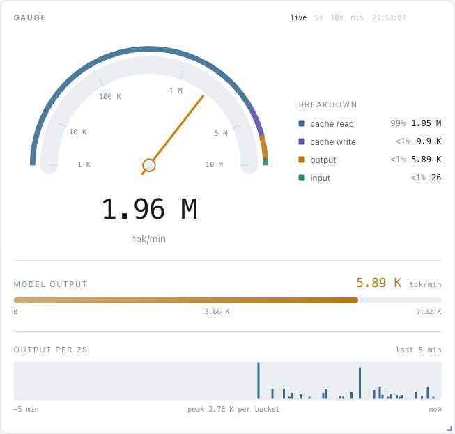

<p align="center">
  
</p>

<h1 align="center">cburn</h1>

<p align="center">
  A local speedometer for Claude Code token spend.
</p>

<p align="center">
  
</p>

cburn watches every Claude Code session on the machine and turns the transcripts
into a live picture of where the tokens go. The needle climbs while Claude works
and glides down in silence; around it - the day's totals, the cost at API prices,
the subscription limit windows and the sessions in flight.

Everything happens locally: the transcripts are read straight from
`~/.claude/projects`, and the conversation text never leaves the machine.

## What it does

- **Live gauge** - the burn rate over WebSocket, moving within a second of a turn landing in a transcript.
- **Cost and totals** - tokens by kind, dollars at API prices, models and tools of the day.
- **Subscription limits** - the 5-hour and weekly windows, refreshed from Anthropic.
- **Advisor** - once an hour `claude -p` reads an anonymised digest and suggests optimisations, with optional telegram notifications.
- **Menu-bar tray** - a Tauri wrapper puts the figures you pick into the macOS menu bar.
- **OTLP receiver** - takes Claude Code telemetry for what the transcripts do not carry.

## Quick start

Python 3.11+ and Node are required.

```bash
make install   # .venv, an editable install and the npm dependencies
make web       # build the frontend into web/dist
make reindex   # read the transcripts into the database
make serve     # the dashboard on http://127.0.0.1:8799
```

The interface speaks English and Russian and ships eighteen colour themes
borrowed from VS Code. `cburn install` adds autostart at login (launchd).

## Privacy

Only tool names, normalised commands, paths and numbers reach the advisor; what
you typed stays on your screen. `~/.claude` is read-only for cburn - the single
exception is applying an advice you confirmed, always with a backup and a
rollback.

## Development

A bare `make` prints the whole toolbox: the checks (`make check` before every
commit), the hot-reload frontend, the desktop window, the telemetry receiver.
The full specification lives in [TZ.md](TZ.md).

## License

MIT
