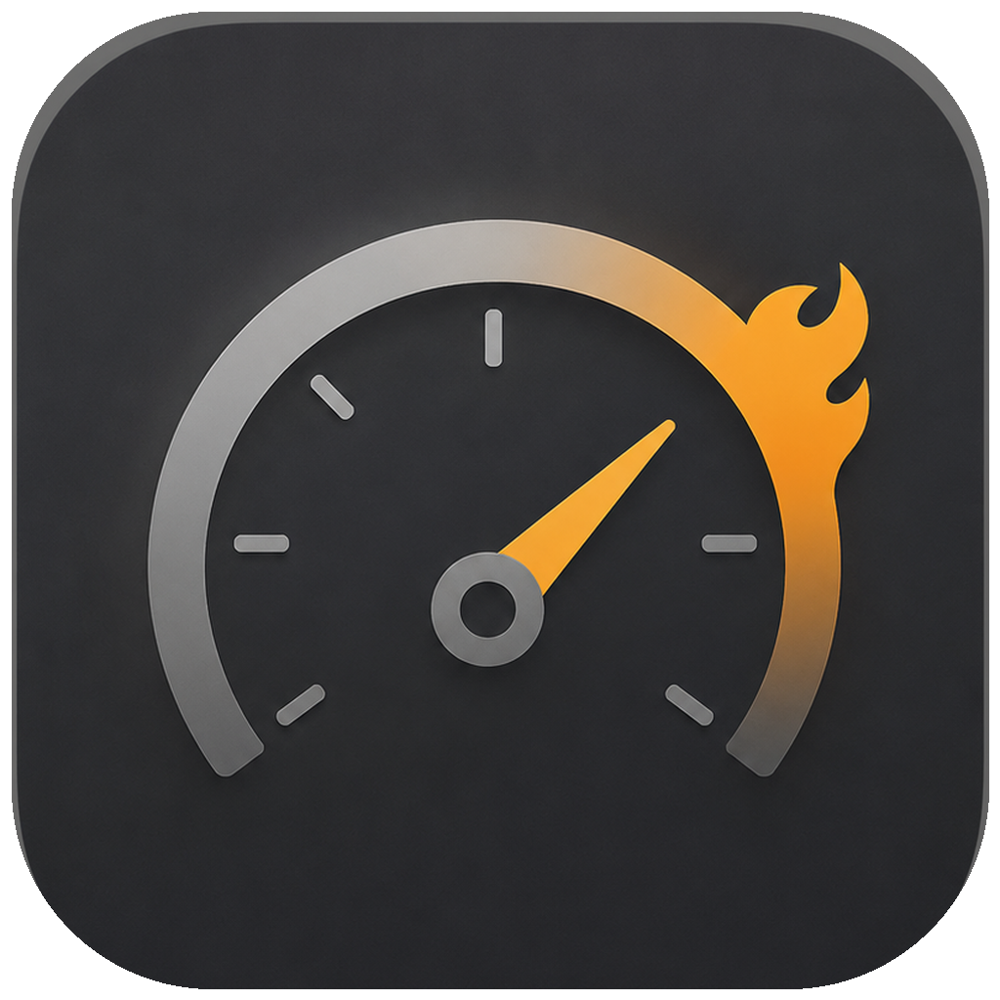
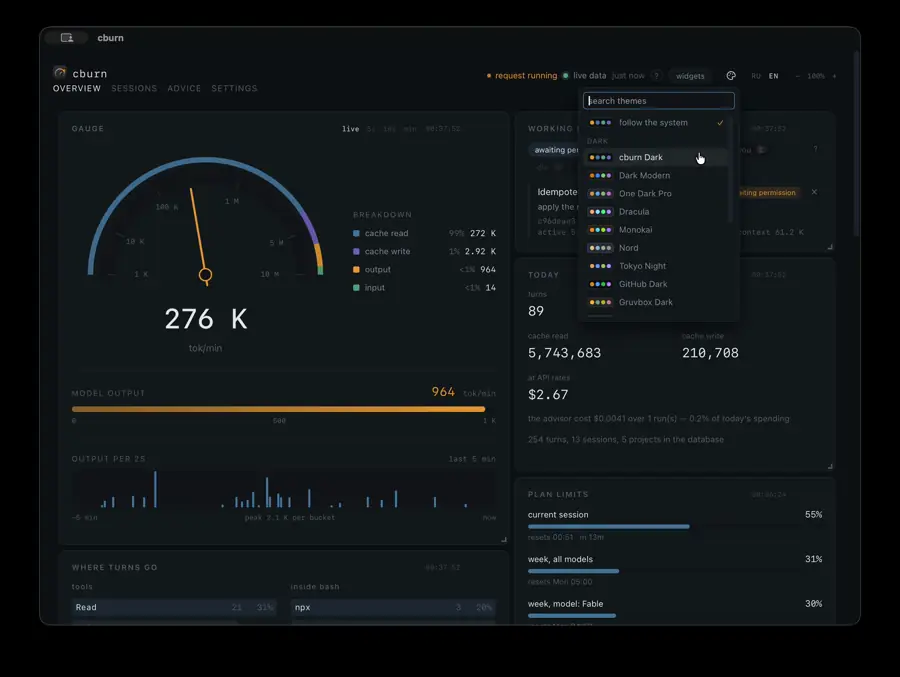
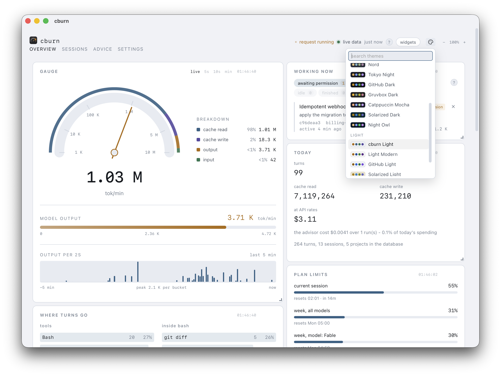
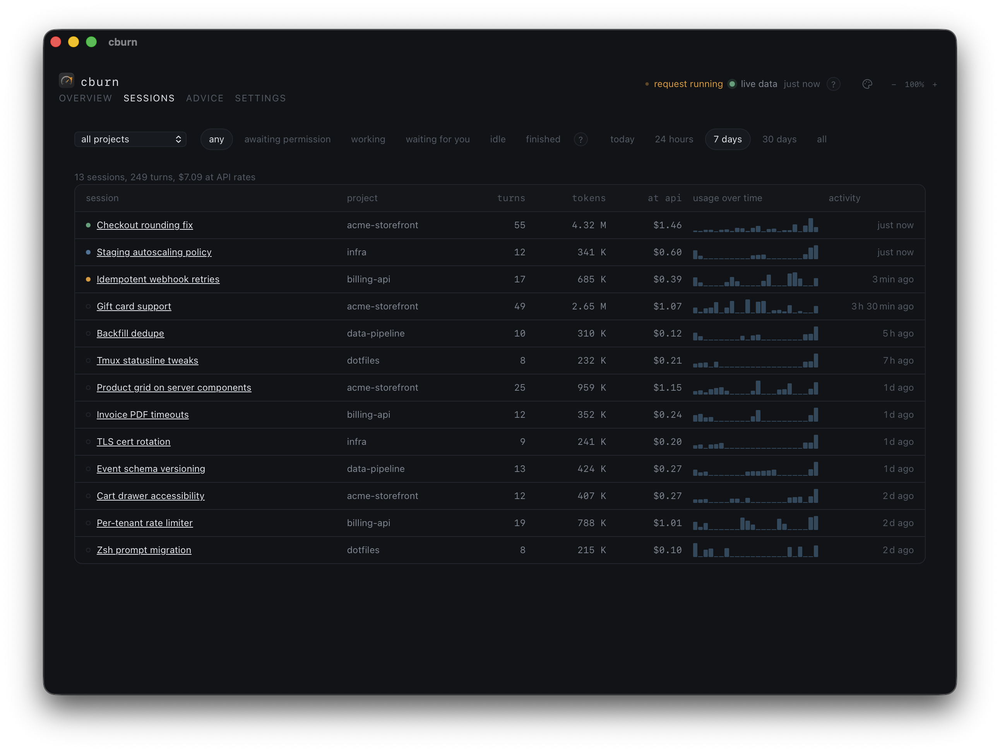
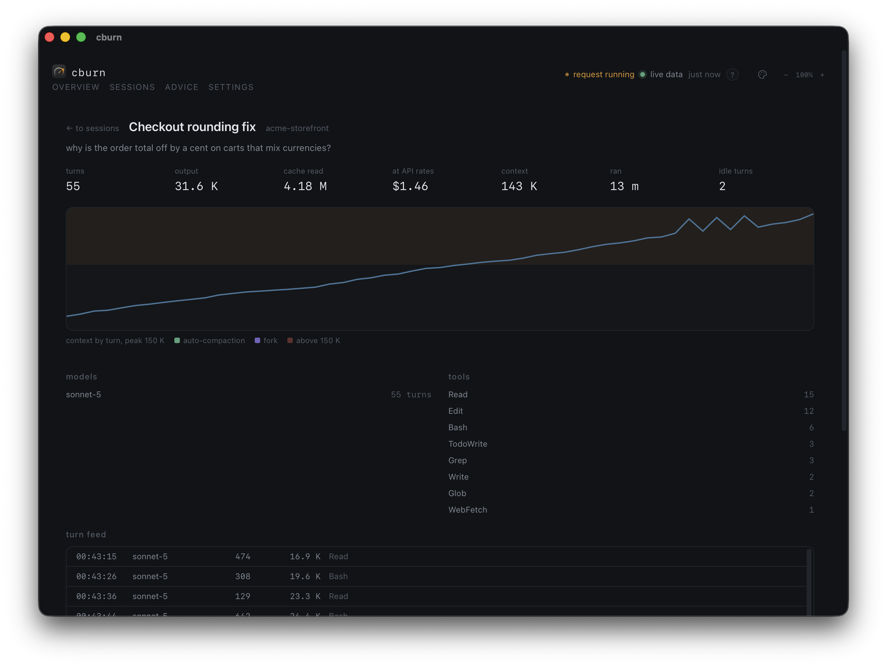
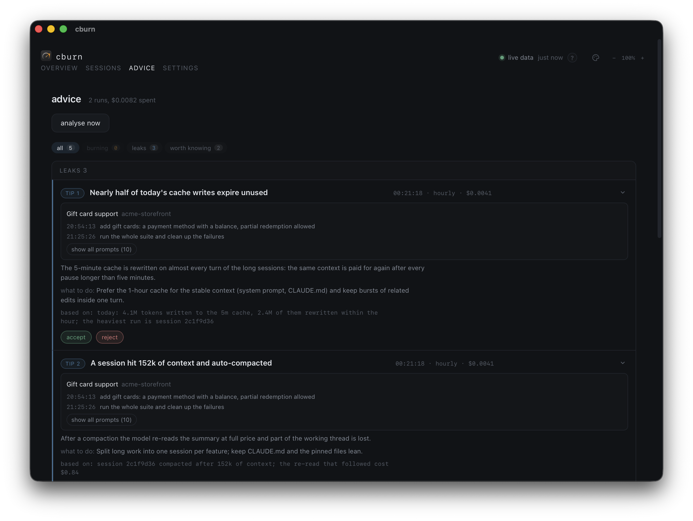
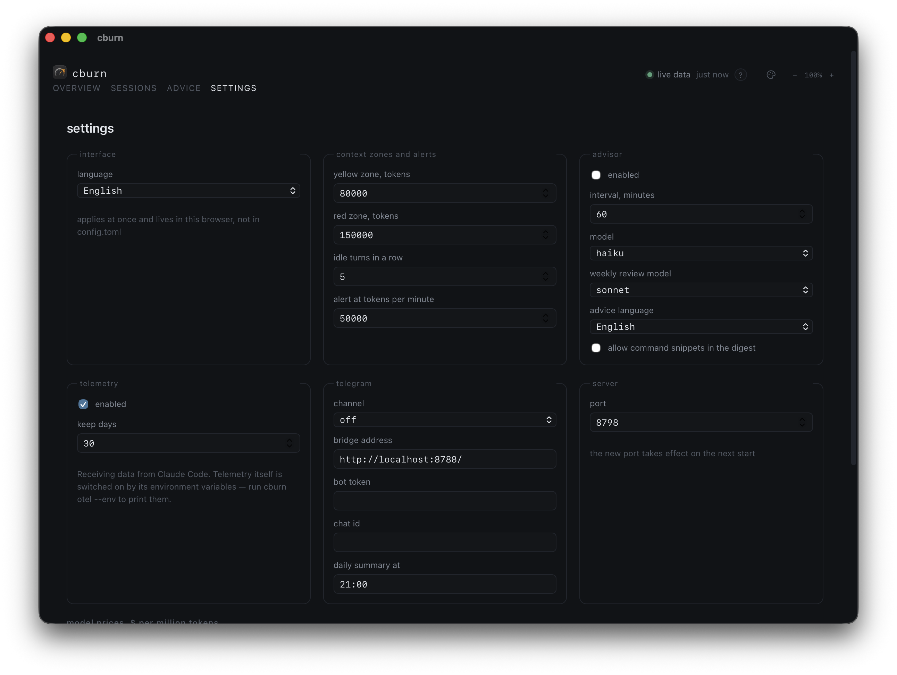
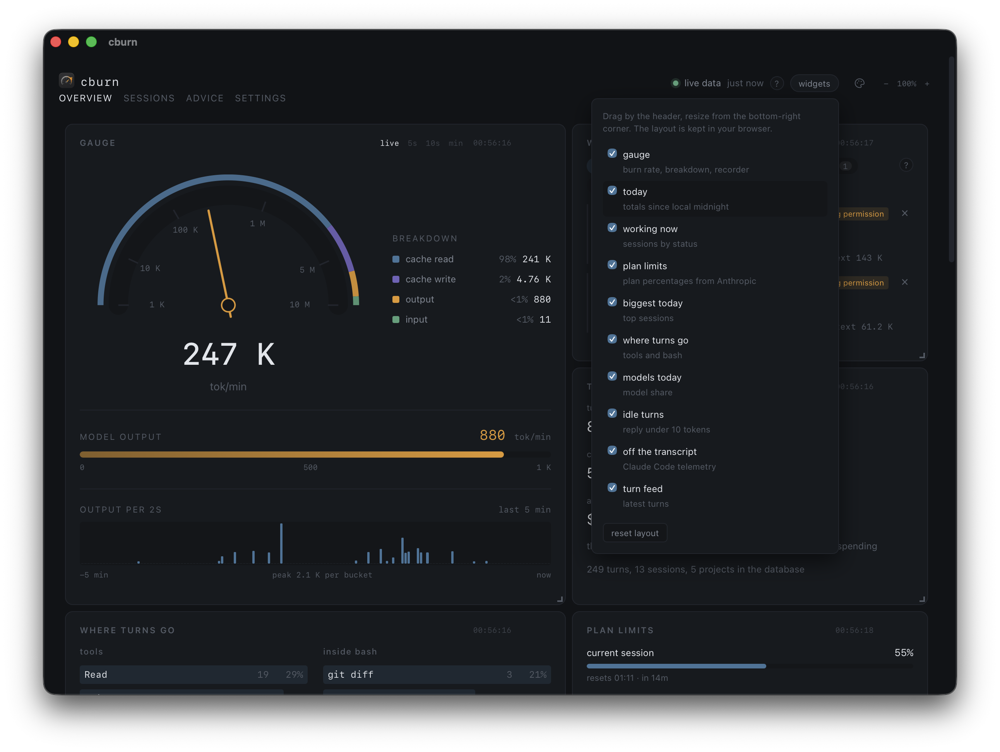
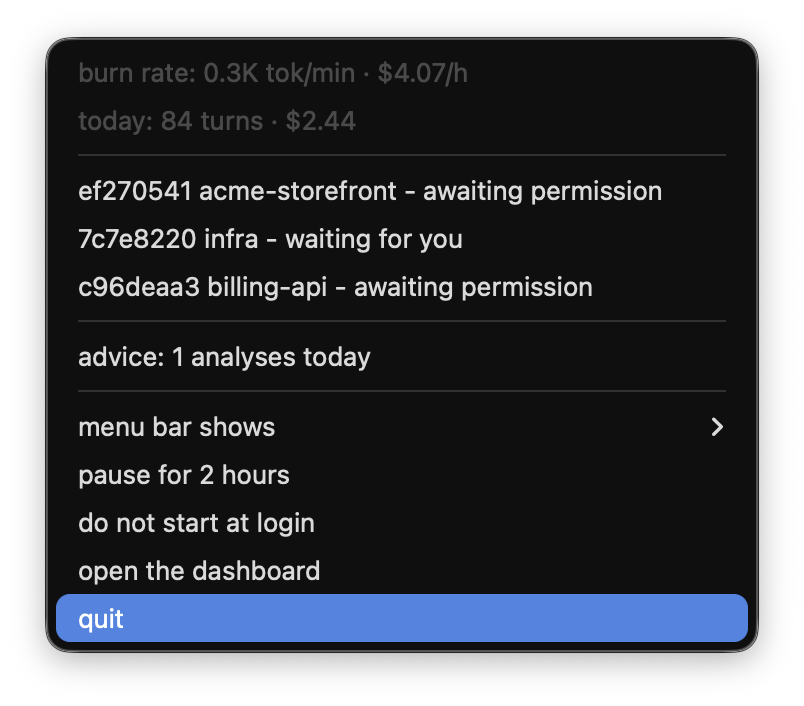

<p align="center">
  
</p>

<h1 align="center">cburn</h1>

<p align="center">
  <b>Claude burns. cburn watches.</b>
</p>

<p align="center">
  <a href="LICENSE"></a>
  
  
</p>

<p align="center">
  
</p>

<p align="center">
  <sub><a href="media/demo.mp4">The whole tour</a> - a minute and a bit over the demo
  dataset: the gauge, the palettes, the sessions and the advisor.</sub>
</p>

Counting tokens after the fact is easy, and several tools do it. cburn is here for
the next question: **what to change so that there are fewer of them.** Once an hour it
reads an anonymised digest of the day and comes back with named, numbered advice -
this session has outgrown its context, these 1768 bash calls want a skill, that MCP
server takes three seconds at every start and has never been called. Part of it is
carried out by one button, with a diff to look at first and a rollback after.

The gauge on the front page is the other half: the burn rate live, so a session that
went wrong is visible while it is going wrong rather than in tomorrow's bill.

Everything happens locally: the transcripts are read straight from
`~/.claude/projects`, and the conversation text never leaves the machine.

## Install

```bash
brew install cloudo/tap/cburn
cburn reindex   # read the history in; without it the dashboard starts from now
cburn serve     # the dashboard on http://127.0.0.1:8799
```

The full name is not decoration. Since Homebrew 6.0 a non-official tap is loaded only
once it is trusted, so `brew tap cloudo/tap && brew install cburn` stops with
`Refusing to load formula cloudo/tap/cburn from untrusted tap`. Installing by the
fully qualified name trusts this one formula and nothing else; `brew trust cloudo/tap`
is the other door, and it trusts everything the tap will ever hold.

The first install is the slow one. `orjson` and `pydantic-core` are Rust underneath and
Homebrew builds every wheel from source, so the formula pulls a Rust toolchain as a build
dependency: seven or eight minutes on an M1, most of it downloading.

`cburn install` puts it into autostart at login through launchd. The menu-bar
application is a separate download - `cburn-VERSION-macos.zip` from the
[latest release](https://github.com/cloudo/cburn/releases/latest). It is not signed,
so macOS holds it at arm's length the first time: open it from the Finder with a right
click and "Open", or lift the quarantine flag by hand.

```bash
xattr -dr com.apple.quarantine /Applications/cburn.app
```

<details><summary>From source</summary>

```bash
git clone https://github.com/cloudo/cburn.git && cd cburn
make install   # .venv, an editable install and the npm dependencies
make web       # build the frontend into web/dist
make reindex   # read the transcripts into the database
make serve     # the dashboard on http://127.0.0.1:8799
```

`make desktop-build` puts the application into
`src-tauri/target/release/bundle/macos`; Rust is needed for that one.
</details>

## Requirements

macOS 13 or newer, Apple Silicon or Intel. Python 3.11+ and Node to build, Rust
only for the menu-bar application. And Claude Code itself, naturally: cburn reads
the transcripts it leaves in `~/.claude/projects` and never writes there.

## What the advisor finds

Every hour `claude -p` reads a digest of the period - aggregates, the heavy sessions,
the tool profile, the model share, and what Claude Code's own telemetry adds on top.
Each tip has to rest on numbers from that digest; a tip without them is not issued.
What it looks for falls into three kinds.

**Something has outgrown itself**

- a session whose context has swollen: paid for again on every turn, and the advisor
  offers to close it in a pause between steps
- one task carried through several `resume`: each continuation reads the whole
  context in again
- `CLAUDE.md` and the pinned files: they ride along with every single request, so an
  extra kilobyte is multiplied by the number of turns

**The work is done by the wrong instrument**

- an expensive model on mechanical turns - the ones that only read and searched
- the same command over and over: 1768 calls of `Bash`, 265 of them `grep`, is a skill
  waiting to be written
- the model share of the day, when a cheaper one would have done

**Something is spent for nothing**

- idle turns: the context was paid for and the answer came back shorter than ten tokens
- an MCP server that takes seconds to connect at every start and was never called
- hooks that eat the time between turns
- permissions confirmed by hand again and again - the advisor writes the rule for
  `permissions.allow` itself
- service requests that never reach a transcript at all, so every other number is
  understated by exactly that much

A tip that can be carried out carries an action: close the session, add the permission
rule, switch off the hook or the plugin. Nothing runs by itself - the diff of the file
is shown first, a backup is kept, and the change can be rolled back. What you reject
does not come back on the next tick.

## What it shows

- **Live gauge** - the burn rate over WebSocket, moving within a second of a turn landing in a transcript.
- **Cost and totals** - tokens by kind, dollars at API prices, models and tools of the day.
- **Subscription limits** - the 5-hour and weekly windows, refreshed from Anthropic.
- **Sessions** - what each one is waiting for right now, how its context grew, where it went idle.
- **Menu-bar tray** - a Tauri wrapper puts the figures you pick into the macOS menu bar.
- **OTLP receiver** - takes Claude Code telemetry for what the transcripts do not carry.

## The screens

<p align="center">
  <picture>
    <source media="(prefers-color-scheme: dark)" srcset="media/dashboard-dark.png" />
    
  </picture>
</p>

<p align="center">
  <sub>The overview in the colours of your system. Eighteen palettes are borrowed
  from the VS Code themes of the same name, so the dashboard offers the choice you
  already made in the editor.</sub>
</p>

<p align="center">
  
  
</p>

<p align="center">
  <sub>Every session with filters and a spark of its spend; inside one - the context
  by turn, the tools it leaned on and the whole turn feed.</sub>
</p>

<p align="center">
  
  
</p>

<p align="center">
  <sub>The advisor groups its tips by what they cost and remembers the ones you
  rejected; thresholds, models and the telegram channel are edited on the spot.</sub>
</p>

<p align="center">
  
  
</p>

<p align="center">
  <sub>Widgets are dragged, resized and hidden, and the layout stays in the browser;
  the tray carries the figures you pick and the sessions waiting for you.</sub>
</p>

<p align="center">
  <sub>All the screenshots show a synthetic demo dataset - <code>make demo</code>
  generates it and serves a second dashboard without touching the real database.</sub>
</p>

## Telemetry (optional)

Claude Code can export OTLP metrics and events, and cburn ships a receiver for
them. Telemetry fills the gaps the history files cannot: service spend that
never reaches a transcript (session titles cost a separate haiku call), how
often work stopped for a permission prompt, exact request prices and durations,
time spent inside tools and hooks.

It is off by default because only Claude Code's own environment can switch it
on - cburn never writes into another program's config. Print the ready-made
lines, paste them into your shell profile or `settings.json` and restart
Claude Code:

```bash
cburn otel --env
```

Everything stays on the machine: the exporter points at the local receiver
inside `cburn serve`, and prompt or response texts are dropped at parsing -
only counters and durations are stored. Without telemetry the dashboard simply
counts the old way, from the transcripts alone.

## Privacy

Only tool names, normalised commands, paths and numbers reach the advisor; what
you typed stays on your screen. `~/.claude` is read-only for cburn - the single
exception is applying an advice you confirmed, always with a backup and a
rollback.

## FAQ

**The dashboard is empty after a clone.** The frontend is not committed: run
`make web` once, and `/` serves the page instead of a list of endpoints.

**"limits unavailable: no Claude Code token in the keychain".** The limits come
from the same endpoint `/usage` uses, authorised with the OAuth token Claude Code
keeps in the keychain. The message covers the case where the request never left
the machine as well - if the token is in place, the reason is in
`~/.local/share/cburn/serve.log`.

**`make desktop` refuses to start.** The application lives in a single copy, so a
second launch would be handed over to the one already in the tray. Quit it there
and run the command again.

**Where everything lives.** `cburn paths` prints it: the database and the log in
`~/.local/share/cburn`, the config in `~/.config/cburn/config.toml`. The
transcripts stay where Claude Code put them.

## Uninstall

```bash
cburn uninstall                              # the launchd agent
rm -rf ~/.local/share/cburn ~/.config/cburn  # the database, the log, the config
```

The application, if you moved it into `/Applications`, goes to the bin like any
other. Nothing of cburn is left inside `~/.claude`.

## Development

A bare `make` prints the whole toolbox: the checks (`make check` before every
commit), the hot-reload frontend, the desktop window, the telemetry receiver.
`make demo` raises a second dashboard over a synthetic dataset - the screenshots
above come from it. What is done and what lies ahead is in the
[roadmap](ROADMAP.md), and every requirement in detail is in the
[specification](SPEC.md).

## License

[MIT](LICENSE)
